Galaxy
=========

.. _galaxy:

Warning: this page is under construction and review. 

Galaxy platform
---------------

Galaxy is a well known, Web-based platform of tools, aimed primarily at bioinformaticians, but
has broadened in scope over the years. With generous help from the Galaxy community, we
have ported PhysiCell Studio to run as an Interactive Tool. Currently, it is running on the EU instance of Galaxy (http://usegalaxy.eu) and should be running on other instances soon. If you do
not yet have an account, register for one - it is free and requires very little information.
Once you have an account, login and follow the steps below to run PhysiCell Studio.

Initial comments
****************

* currently only 2D models are allowed
* when you run PhysiCell Studio, it starts from scratch, i.e., it does not retain the results from a previous session. Therefore, if you want to save results from a session, e.g., a model (.xml) or its initial conditions or rules (.csv), or a simulation's results (in the /output directory), you will need to explicitly do that before quitting PhysiCell Studio.
* some functionality found in the desktop version is missing in the Galaxy version
* a session remains active for about 24 hours
* to reconnect a Studio session if it disconnects temporarily, simply refresh its web page 
* there is only one /output directory for simulation results
* when you "Run" a simulation (in the Run tab), the current .xml model config file will be overwritten with any changes to model parameters, and all existing files in the /output directory will be deleted and new simulation results will be written to /output (but will not persist across multiple Studio sessions)
* output results (5 files) will be automatically saved only when one quits the tool ("Studio menu -> Quit")
* to save results manually, use the "File -> put on History" menu item.

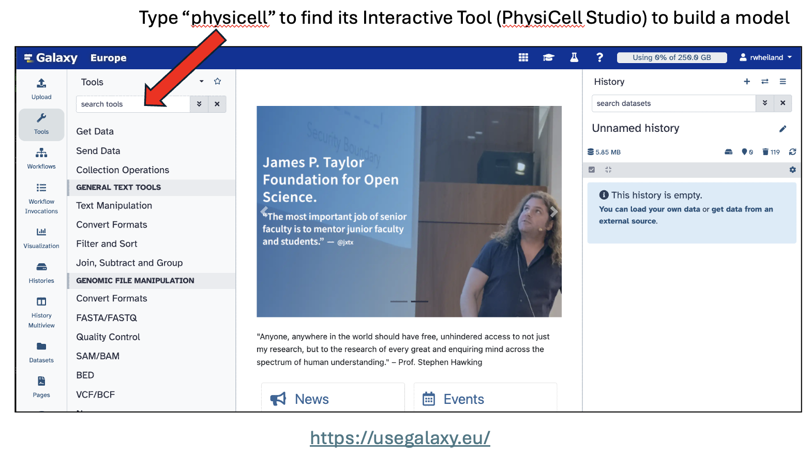
* the Galaxy Tools column lists all available tools. You can search for "PhysiCell Studio"

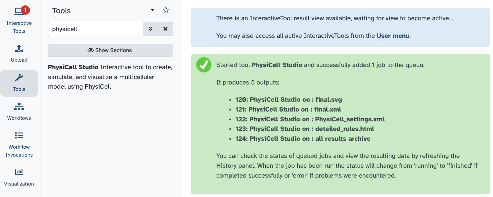
* the tool takes some time (hopefully, just seconds) to become active
* notice that the tool "produces 5 outputs". However, as noted in the initial comments above, these files only get generated if/when the user quits the tool. To save results during a session, use "File -> put on History".

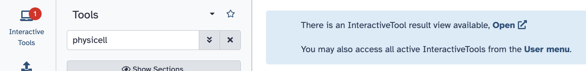
* after the "Open" link appears, click it

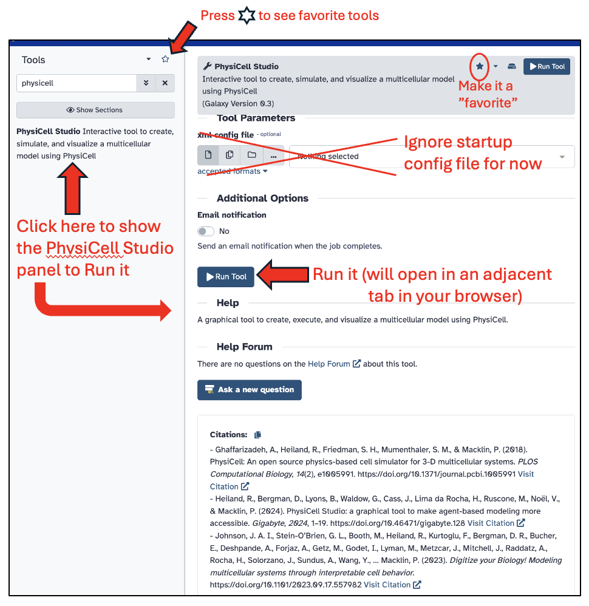
* click the `Run Tool` to open PhysiCell Studio in an adjacent tab of your browser

Studio GUI settings
*******************

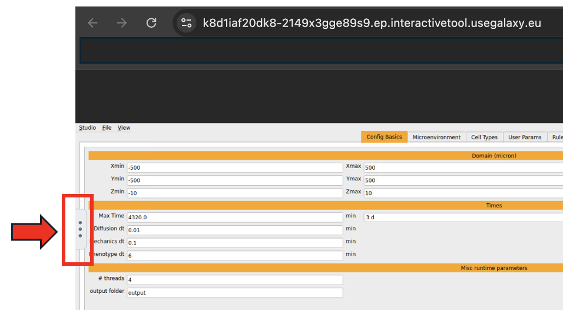
* when the Studio appears in its own tab, its widgets will appear too small. To remedy this, click the "3 vertical dots" icon on the left border. It will display settings for the GUI.

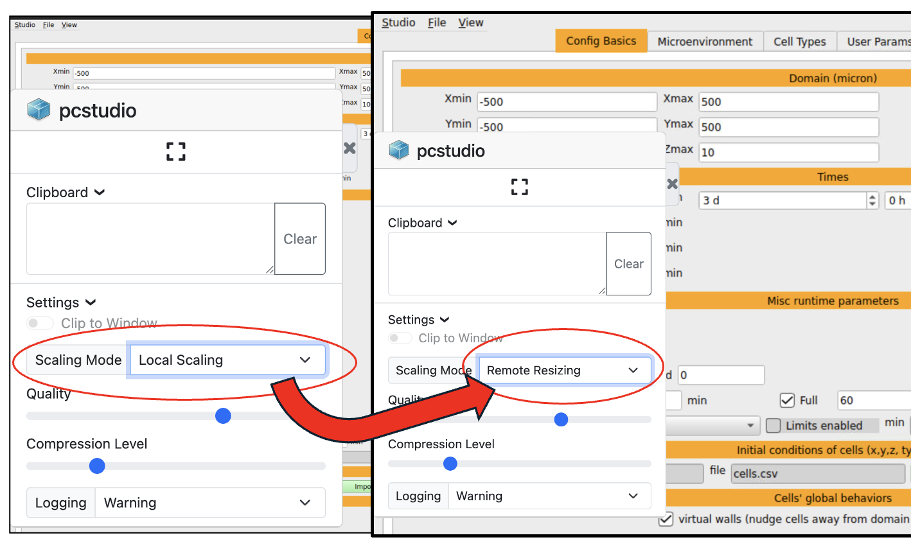
* then select the "Scaling Mode" dropdown menu and select "Remote Resizing". This should improve the overall usability of the GUI.

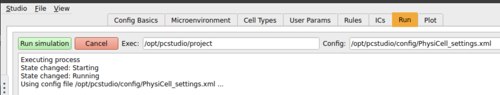
* to run the default simulation, click the Run tab and press the "Run simulation" button.

Studio overview
***************

At this point, you should be able to follow instructions elsewhere for basic use of the Studio. 
https://physicell-studio.readthedocs.io/en/latest/guide.html#config-basics . HOWEVER, you will want to return to this page for Galaxy-specific instructions, especially regarding loading files and saving simulation results.

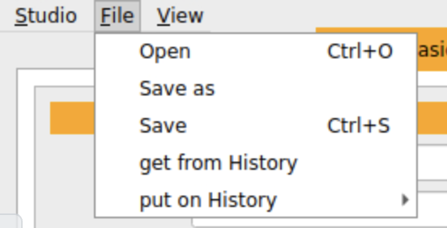
* to open a different model that comes with PhysiCell Studio: File -> Open 

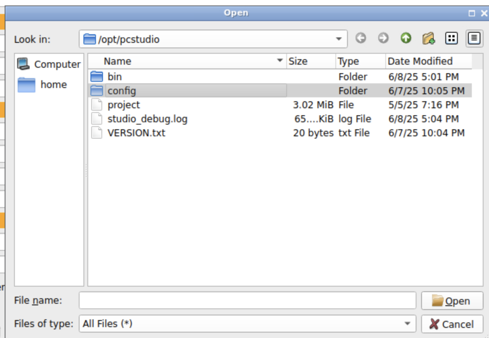

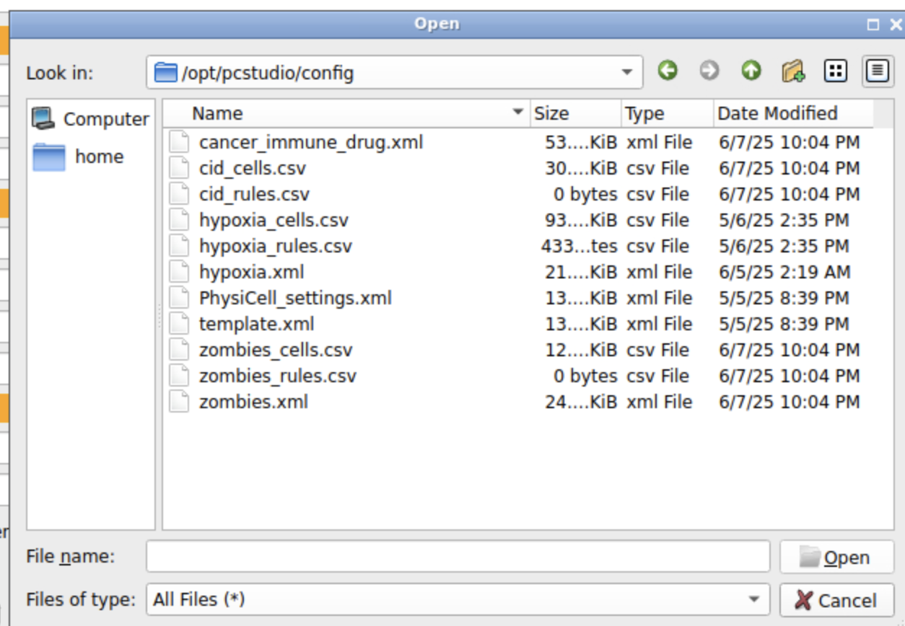
* select one of the .xml files to explore a different model (the default, PhysiCell_settings.xml, is identical to template.xml)

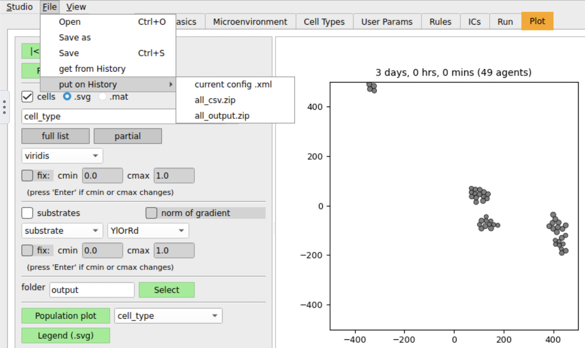
* save various output results to the Galaxy History (found on the main Galaxy browser tab)

Reconnect the Studio session
****************************

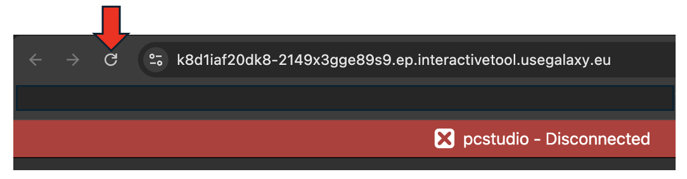
* if you see "pcstudio - Disconnected", just refresh this page in your browser to reconnect

Upload a local file
*******************

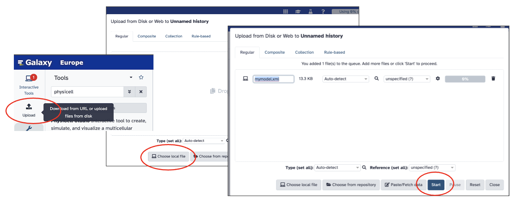
* on the main Galaxy interface, use the Upload tool to get a file from your local computer. It will appear in the Galaxy History.

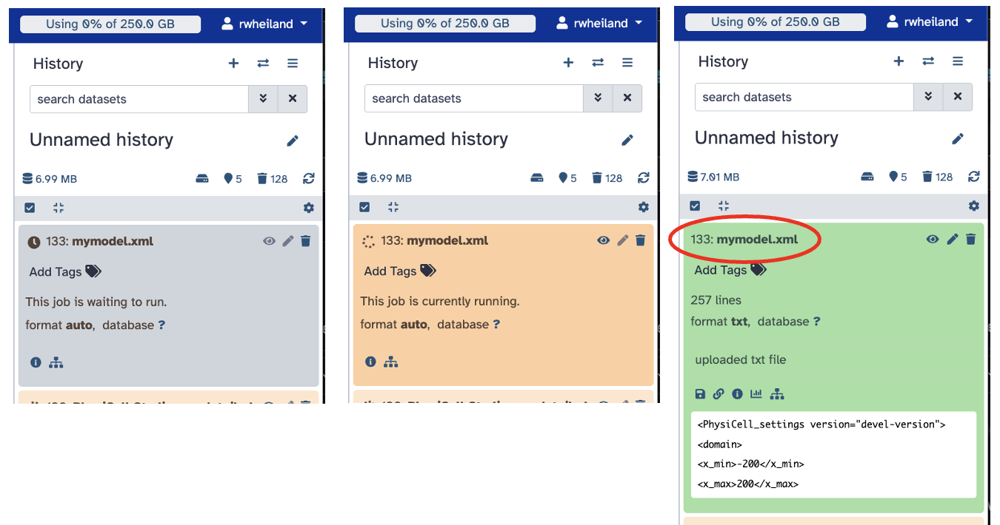
* in the Galaxy History, the new file will appear in 3 stages (a job starts (gray) to upload it, the job runs (orange), the job completes (green))

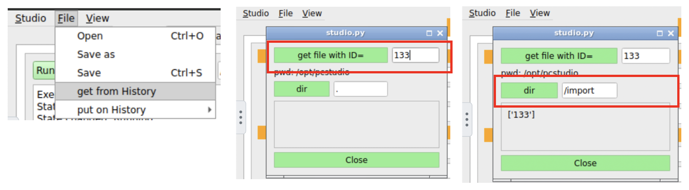
* in the Studio, use "File -> get from History" to get this file (by ID)