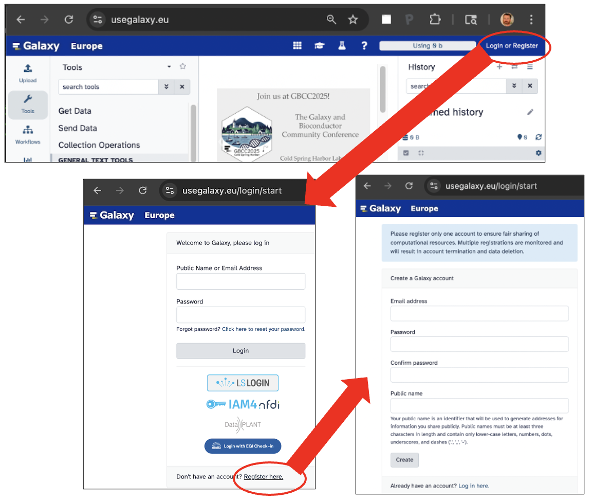
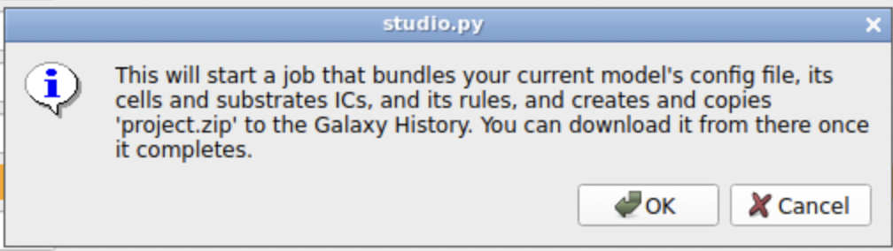
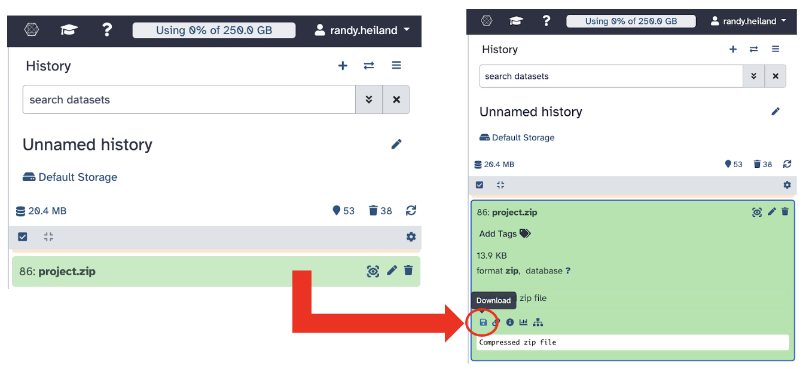

Galaxy
=========

.. _galaxy:

NOTE:  This page continues to evolve. We welcome feedback on our `Slack channel <https://physicellcomm-sf93727.slack.com/join/shared_invite/zt-36twj00ub-k4fR0vsyWWbSq3Aamuukbg#/shared-invite/email>`_

Galaxy is a well known, Web-based platform of tools, aimed primarily at bioinformaticians, but
has broadened in scope over the years. With generous help from the Galaxy community, we
have ported PhysiCell Studio to run as an Interactive Tool. Currently, it is running on both the ORG and EU instances of Galaxy. If you do
not yet have an account, register for one - it is free and requires very little information.
Once you have an account, login and follow the steps below to run PhysiCell Studio.

Initial comments
****************

* currently only 2D models are allowed
* when you run PhysiCell Studio, it starts from scratch, i.e., it does not retain the results from a previous session. Therefore, if you want to save results from a session, e.g., a model (.xml) or its initial conditions or rules (.csv), or a simulation's results (in the `/output` directory), you will need to explicitly do that before quitting PhysiCell Studio.
* some functionality found in the desktop version is missing in the Galaxy version
* a session remains active for about 24 hours
* there is only one `/output` directory for simulation results
* when you "Run" a simulation (in the Run tab), the current .xml model config file will be overwritten with any changes to model parameters, and all existing files in the `/output` directory will be deleted and new simulation results will be written to `/output` (but will not persist across multiple Studio sessions)
* output results (5 files) will be automatically saved only when one quits the tool ("Studio menu -> Quit")
* to save results manually, use the "File -> put on History" menu item.

Register for a Galaxy account
*****************************

* Registering for a Galaxy account should be straightforward. Try to register at https://usegalaxy.org/ and if you have problems, try https://usegalaxy.eu/ .

Login and start PhysiCell Studio
********************************

After successfully registering for and getting an account on Galaxy, you are ready to
use its tools. The one of interest for this tutorial is PhysiCell Studio.

.. image:: ./galaxy_imgs/galaxy_tools.png
* the Galaxy Tools column lists all available tools. You can search for "PhysiCell Studio"

.. image:: ./galaxy_imgs/pcstudio_wait_active.png
* the tool takes some time (maybe a minute or two) to become active
* notice that the tool "produces 5 outputs". However, as noted in the initial comments above, these files only get generated if/when the user quits the tool. To save results during a session, use "File -> put on History".

.. image:: ./galaxy_imgs/pcstudio_ready_to_open.png
* after the "Open" link appears, click it

.. note::

  If the "Open" link seems to take too long to appear, check to see if you have a previous Studio or another Interactive Tool already running (select the "Interactive Tools" icon in the left column). You are not allowed more than one Interactive Tool to run simultaneously.

.. image:: ./galaxy_imgs/galaxy_pcstudio_0.png
* click the `Run Tool` to open PhysiCell Studio in an adjacent tab of your browser

Studio GUI settings
*******************

.. image:: ./galaxy_imgs/pcstudio_remote_settings_widget.png
   :width: 600px
* when the Studio appears in its own browser tab, its widgets will appear too small. To remedy this, click the "3 vertical dots" icon on the left border. It will display settings for the GUI.

.. image:: ./galaxy_imgs/pcstudio_remote_resizing.png
   :width: 600px
* then select the "Scaling Mode" dropdown menu and select "Remote Resizing". This should improve the overall usability of the GUI.

.. image:: ./galaxy_imgs/pcstudio_run_sim0.png
* to run the default simulation, click the Run tab and press the "Run simulation" button.

Studio overview
***************

At this point, you should be able to follow instructions elsewhere for basic use of the Studio. 
https://physicell-studio.readthedocs.io/en/latest/guide.html#config-basics . HOWEVER, you will want to return to this page for Galaxy-specific instructions, especially regarding loading files and saving simulation results.

Reconnect the Studio session
****************************

.. image:: ./galaxy_imgs/pcstudio_refresh_to_reconnect.png
   :width: 400px
* if you see "pcstudio - Disconnected", it should automatically reconnect (in the latest version of Galaxy); however, if not, just refresh this page in your browser to manually reconnect.

Saving your project
*******************

It is GOOD PRACTICE TO INCREMENTALLY SAVE the model you are developing. This is especially true
for an interactive cloud-hosted application like PhysiCell Studio running in Galaxy. So, as you 
edit parameters, run a [partial] simulation, plot results, and like what you see (or maybe 
don't like it, but want to keep it anyway) - you can save the current state of your model 
using the `File -> Save project` menu option:

.. image:: ./galaxy_imgs/pcstudio_File_Save_proj.png
   :width: 400px

This will notify you of what happens next: it will create and copy `project.zip` to your History column on the main Galaxy panel.

When you do this, a `project.zip` entry will appear in your Galaxy History (it may take a 
few seconds to appear). If you click on that entry, it will expand and reveal a download 
icon that, when clicked, will download it to your local computer and give it an expanded name,
`Galaxy<ID#>-\<filename>`. 

Unzipping that file on your computer will provide the 
files that define your project, typically: PhysiCell_settings.xml, cell_rules.csv, and cells.csv.

Loading a project
*****************

