Galaxy
=========

.. _galaxy:

NOTE:  This page continues to evolve. We welcome feedback on our `Slack channel <https://physicellcomm-sf93727.slack.com/join/shared_invite/zt-36twj00ub-k4fR0vsyWWbSq3Aamuukbg#/shared-invite/email>`_

Galaxy is a well known, Web-based platform of tools, aimed primarily at bioinformaticians, but
has broadened in scope over the years. With generous help from the Galaxy community, we
have ported PhysiCell Studio to run as an Interactive Tool. If you do
not yet have an account, register for one - it is free and requires very little information.
Once you have an account, login and follow the steps below to run PhysiCell Studio.

Initial comments
****************

* currently only 2D models are allowed
* when you run PhysiCell Studio, it starts from scratch, i.e., it does not retain the results from a previous session. However, it is possible to load a previous model. To incrementally save your model as you are developing it (**highly recommended**), use the "File -> Save project" menu item. This will save a `.zip` onto your Galaxy History (details below)
* some functionality found in the desktop version is missing in the Galaxy version
* a session remains active for about 24 hours
* there is only one `/output` directory for simulation results
* when you "Run" a simulation (in the Run tab), the current .xml model config file will be overwritten with any changes to model parameters, and all existing files in the `/output` directory will be deleted and new simulation results will be written to `/output` (but will not persist across multiple Studio sessions)
* output results (5 files) will be automatically saved only when you quit ("Studio menu -> Quit")

Register for a Galaxy account
*****************************

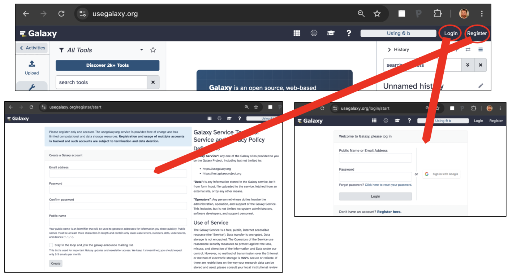
* Registering for a Galaxy account should be straightforward. Try to register at https://usegalaxy.org/ . After you register, check you email for a confirmation message.

Login and start PhysiCell Studio
********************************

After successfully registering for and getting an account on Galaxy, you are ready to
use its tools. The one of interest for this tutorial is PhysiCell Studio.

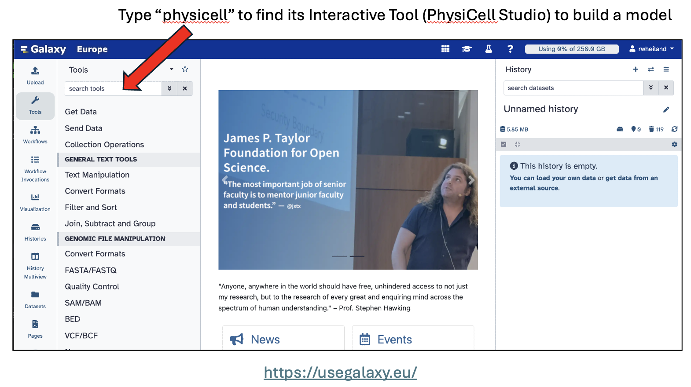
* the Galaxy Tools column lists all available tools. You can search for "PhysiCell Studio"

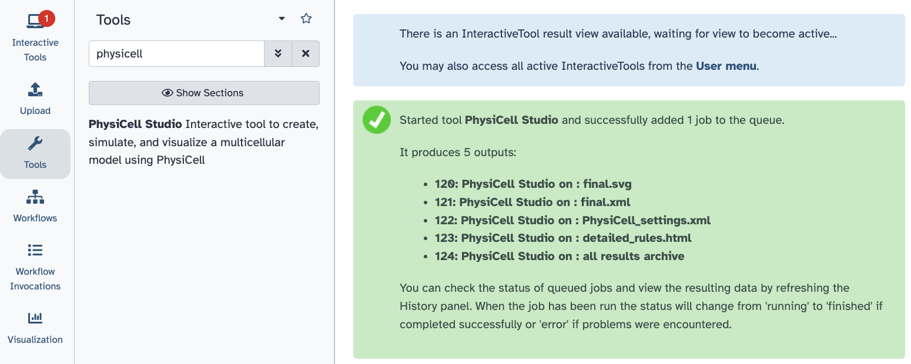
* the tool takes some time (maybe a minute or two) to become active
* notice that the tool "produces 5 outputs". However, as noted in the initial comments above, these files only get generated if/when the user quits the tool. To save a model during a session, use "File -> Save project".

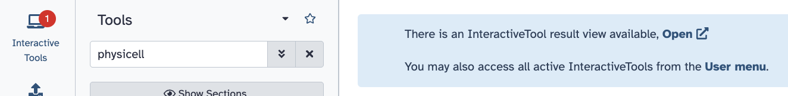
* after the "Open" link appears, click it

.. note::

  If the "Open" link seems to take too long to appear, check to see if you have a previous Studio or another Interactive Tool already running (select the "Interactive Tools" icon in the left column). You are not allowed more than one Interactive Tool to run simultaneously.

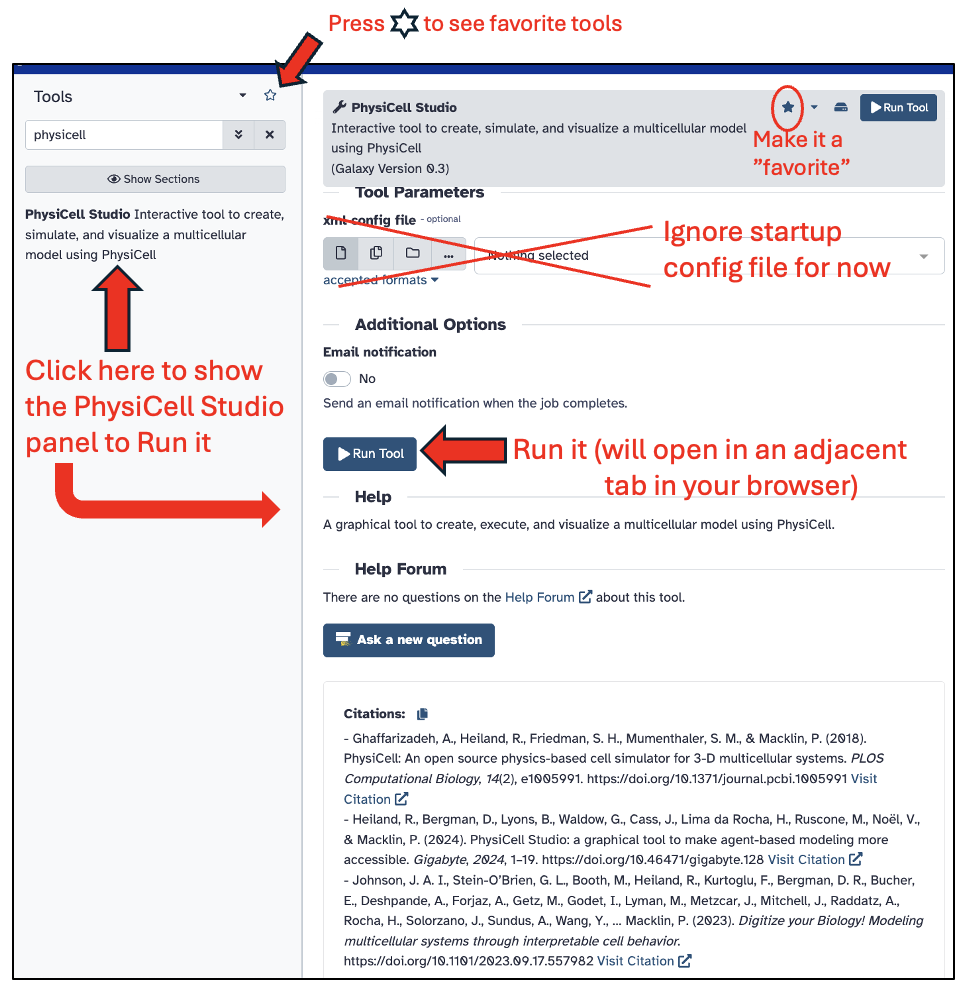
* click the `Run Tool` to open PhysiCell Studio in an adjacent tab of your browser

Studio overview
***************

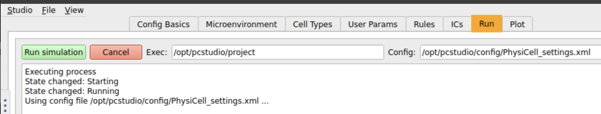
* to run the default simulation, click the Run tab and press the "Run simulation" button.

At this point, you should be able to follow instructions elsewhere for basic use of the Studio. 
https://physicell-studio.readthedocs.io/en/latest/guide.html#config-basics . However, you will want to return to this page for Galaxy-specific instructions, especially regarding saving (or loading) a project, or saving simulation results.

Reconnect the Studio session
****************************

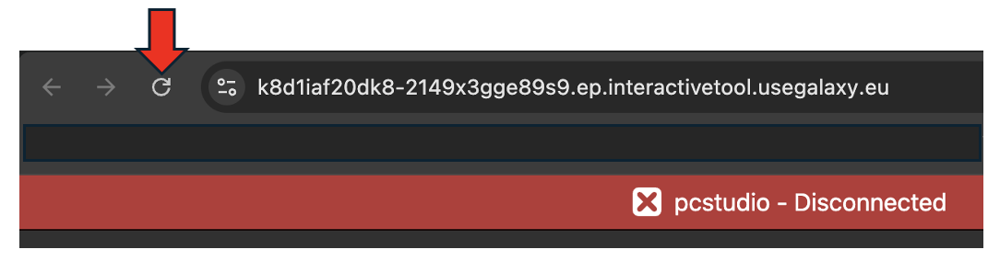
* if you see "pcstudio - Disconnected", it should automatically reconnect (in the latest version of Galaxy); however, if not, just refresh this page in your browser to manually reconnect.

Saving your project
*******************

It is GOOD PRACTICE TO INCREMENTALLY SAVE the model you are developing. This is especially true
for an interactive cloud-hosted application like PhysiCell Studio running in Galaxy. So, as you 
edit parameters, run a [partial] simulation, plot results, and like what you see (or maybe 
don't like it, but want to keep it anyway) - you can save the current state of your model 
using the `File -> Save project` menu option:

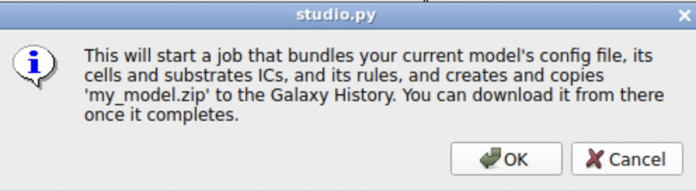

This will prompt you to name your project, e.g., `my_model.zip` (or whatever you choose to name it) 
and will zip together the relevant files and copy the .zip to your History column on the main Galaxy panel.

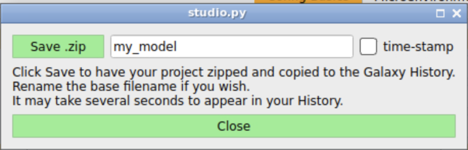

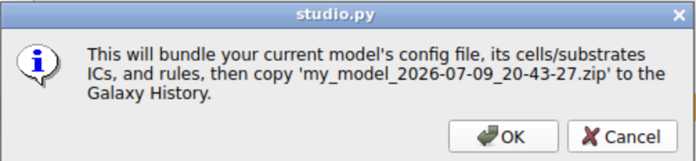

Note that it may take a few seconds for the `.zip` project to appear in your Galaxy History.
If you click on that entry, it will expand and reveal a download 
icon that, when clicked, will download it to your local computer and give it an expanded name,
`Galaxy<ID#>-\<filename>`. 

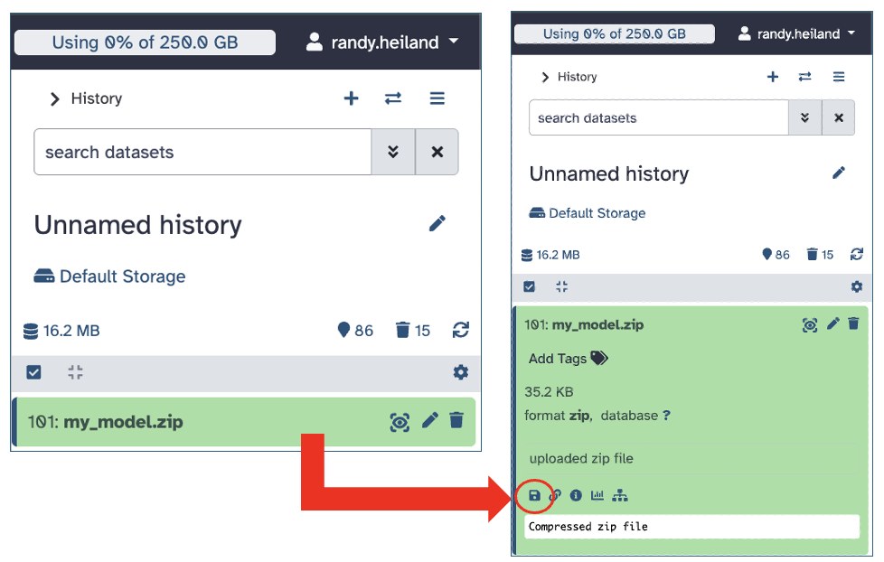

Unzipping that file on your computer will provide the 
files that define your project, typically: PhysiCell_settings.xml, cell_rules.csv, and cells.csv.

Loading a project
*****************

To load a previously saved project, use the `File -> Load project` menu option:

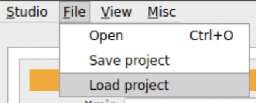

This will display a file dialog of all .zip files in your History (it may take a few seconds if you have several).
Note that a .zip suffix is not unique to project files (you can also zip up your output results, but do not try to
"Load" those).

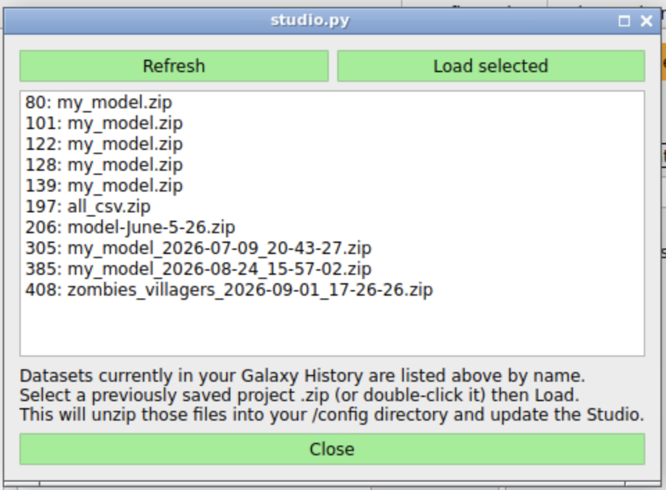

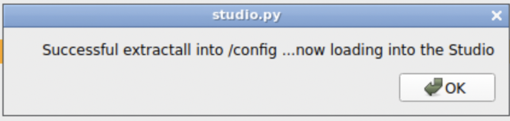

Exporting your project
**********************

An alternative to saving your project to the Galaxy History is to Export it to a GitHub repository.
However, it does require some additional effort.
First, you need to create a `(Fine-grained) Personal Access Token (PAT) <https://docs.github.com/en/authentication/keeping-your-account-and-data-secure/managing-your-personal-access-tokens>`_ for the GitHub repo(s). Then you
need to upload this PAT to your Galaxy History:
1. In Galaxy, click **Upload Data**
2. Choose **Paste/Fetch Data**
3. Paste just your token (nothing else):
4. Set the format to `txt`, give it a name like `github_token` (with no obvious name in history if you're privacy-conscious)
5. Click **Start** — it becomes a dataset in your history

Then in PhysiCell Studio, use the `Studio -> Settings` panel to get the PAT by providing its History ID (you only need to do this once per Studio session):

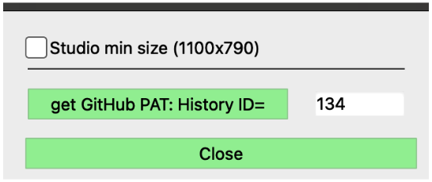

Then you can use the `File -> Export project` menu option:

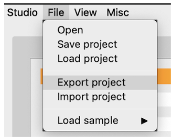

It will request the necessary information and explain what happens next.

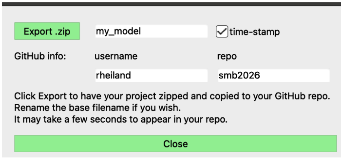

Importing your project
**********************

You can also import a project (.zip) from a GitHub repo. This does not require a PAT (for a public repo). 
Selecting `File -> Import project` will request the necessary information and step you through it. Once it
completes, you will need to do `File -> Open` the .xml configuration file which is probably in the `config`
directory.

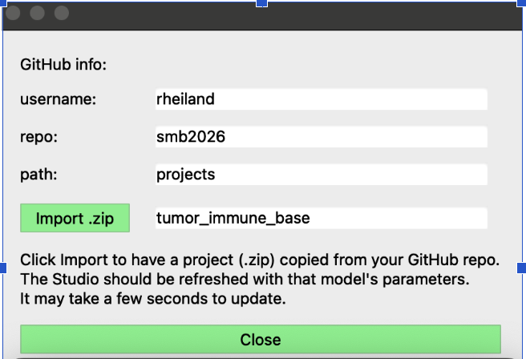

Saving simulation results
*************************

To save all simulation results, you can use the `Misc -> put on History -> all_output.zip` menu item. This can take some time, depending on how many output files you have.

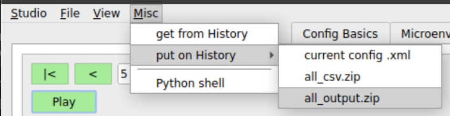

Once it has been zipped and copied to your History, you can download it to your desktop computer:

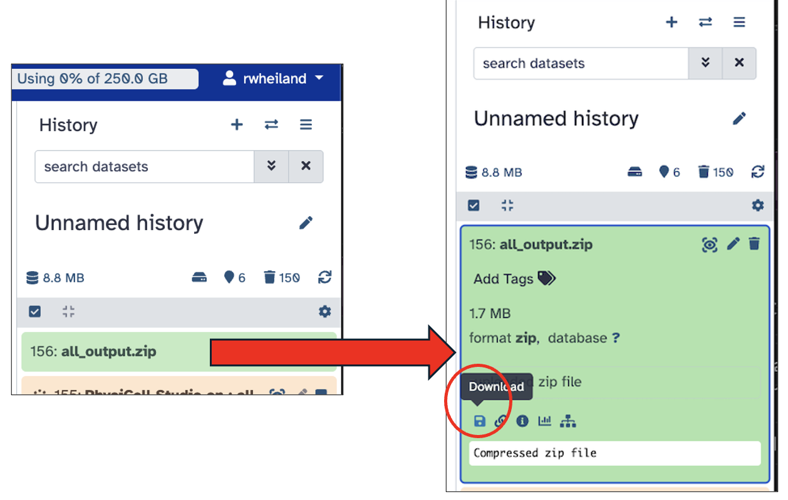
