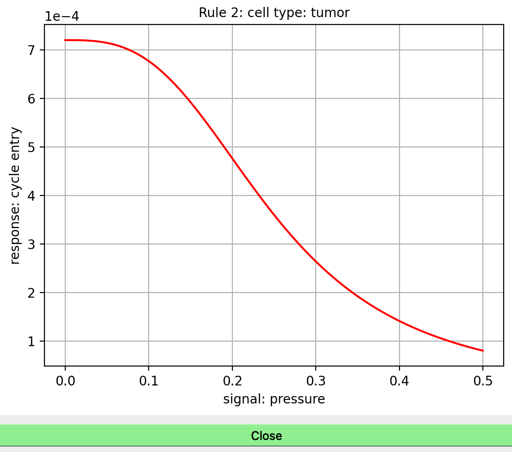
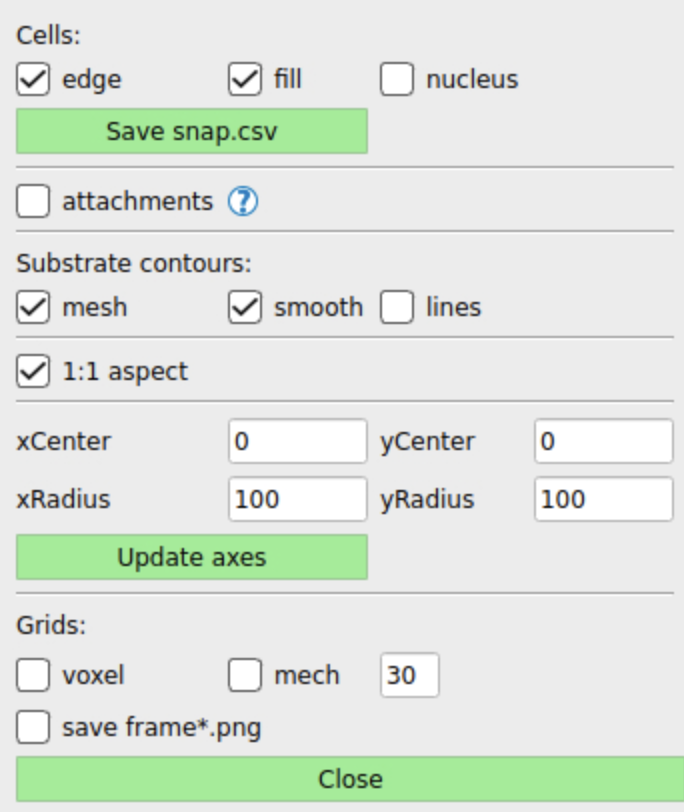

Guide
=====

.. _guide:

PhysiCell Studio is a graphical tool to simplify PhysiCell model editing. It provides a multi-tabbed GUI that allows graphical editing of the model and its associated XML, including the creation/deletion of fundamental objects, e.g., substrates (or signals) in the microenvironment, and cell types. It also lets users run their model and interactively visualize results, allowing for more rapid model refinement.

This User Guide provides brief, but hopefully sufficient, guidance on using the Studio - at least its contents (not the challenges involved in developing your particular model). If you experience problems or have questions, please contact us using an appropriate PhysiCell community Slack channel or https://github.com/PhysiCell-Tools/PhysiCell-Studio/issues of the Studio GitHub repository. The latter is preferred when reporting a fatal error using the Studio. When reporting problems, please provide the Studio version # (found in the `Studio->About` menu) and the steps to reproduce the problem. We welcome Pull Requests to the `development` branch of https://github.com/PhysiCell-Tools/PhysiCell-Studio (see instructions there) for bug fixes and suggested improvements.

This Guide will be updated as the Studio itself is updated, however there may be a lag. Therefore, if you are running a recent release of the Studio, you may notice some differences in the content described here.

Running
-------

It is important to understand that the XML configuration file you are editing in the Studio will be updated (overwritten) when you do `File->Save` or *when you Run a simulation*. Also, the rules you have in your Rules table will automatically be written to the folder/file you have specified in that tab. But the ICs requires that you explicitly `Save` to the .csv file from the ICs tab. The Studio does not do "instantaneous" updates to the XML, so if it encounters a fatal error and crashes, any changes you made will not be automatically saved. Neither does it track changes you made and warn you of unsaved changes when you quit the Studio. Therefore, if you are working on your own model, it is a good practice to `File->Save` (has keyboard shortcut) occasionally and adopt the habit of making backup copies of any files you consider critical.

Overview
--------

.. image:: ./guide_imgs/tabs_only.png

PhysiCell Studio consists of multiple tabs, each representing a logical grouping of model parameters and/or functionality.
Each tab will be described in detail in the sections below, but briefly they are:

* `Config Basics` - define the domain and other misc parameters of the simulation
* `Microenvironment` - define the microenvironment, i.e., one or more substrates (signals) and their parameters
* `Cell Types` - define one or more cell types and the phenotype parameters associated with each
* `User Params` - define optional "user" parameters that are unique to a particular model 
* `Rules` - optional "rules" associated with a cell type that define cell behaviors in response to signals
* `ICs` - convenience functionality to define simple 2D initial conditions (ICs) for cells
* `Run` - run a simulation and show the normal PhysiCell output to the terminal
* `Plot` - provide plotting options for visualizing output results (even while the simulation is being run)

Sample model: virus-macrophage
------------------------------

We will illustrate the Studio using the PhysiCell virus-macrophage model, i.e., we assume you have created
this model:

.. code-block:: console
  ~/PhysiCell$ make reset
  ~/PhysiCell$ make virus-macrophage-sample
  ~/PhysiCell$ make 

If the resulting config/PhysiCell_settings.xml is in a "flattened" format (which the Studio requires)
then you should be able to run:

.. code-block:: console
  ~/PhysiCell$ python studio/bin/studio.py -p -e virus-sample

# However, if you happen to have an older, hierarchical .xml format then you will need to use the flattened one in the studio folder:

.. code-block:: console
  ~/PhysiCell$ python studio/bin/studio.py -c studio/config/virus_macrophage.xml -e virus-sample

Config Basics
-------------

.. image:: ./guide_imgs/config_virus.png

* === Domain ===
* define the model domain size (we recommend leaving dx=dy=dz=20). A 2D model will have Z range: [-dz/2, dz/2, dz]
* === Times ===
* `Max Time` - of the simulation. `+1 day` convenience button to add 1440 mins (1 day)
* `Diffusion/Mechanics/Phenotype dt` - 3 time scales in a PhysiCell model (rf. the PhysiCell method paper). Only modify if you're an advanced user.
* === Misc runtime params ===
* `# threads` - # of OpenMP threads (to help speed up calculations)
* `output folder` - where the output files will be written; relative to where you Run the simulation.
* `Save data(intervals)` - there are (primarily) two types of output files saved by PhysiCell: `SVG` (.svg; for cells' positions, sizes, colors) and `Full` (.mat; for substrate concentrations and custom data). Currently, in the Plot tab, when you plot *both* cells and substrates, it assumes those files were written at the same simulation time. Therefore, you should provide the *same* interval value for both if you plan to plot both. The `Sync` checkbox helps ensure this. However, if you only plan to plot cells' SVG files, then you can set the `Full` interval to a very high value or simply uncheck it to not have any substrate or cells' custom data saved.
* `Plot SVG substrate` - option to also plot a substrate concentration in the .svg files. If this is enabled, you will need to provide the proper arguments to the `SVG_plot` function in your main.cpp (namely, a custom coloring function for the selected substrate). Refer to the `interaction` sample project for an example.
* === Initial conditions of cells ===
* `enable` - check if you are providing a text file that contains data for the initial conditions of cells, including their positions, cell types, etc.
* === Cells' global behaviors
*  `virtual walls` - if checked, indicates that cells should be nudged away from the domain boundaries when they get too close

Microenvironment
----------------

.. image:: ./guide_imgs/microenv_virus.png

* Define the substrates (or signals) used in the model
* Selecting one in the box on the left will update the parameters on the right.
* The `New` button will create a new substrate with default parameters
* The `Copy` button will create a new substrate with the same parameters as the currently selected substrate
* The `Delete` button will delete the currently selected substrate
* To rename a substrate, double-click it, modify the name, and press the Enter/Return key
* The parameters on the right should be mostly self-explanatory. However, note that the `Dirichlet BC`(Boundary Condition) `Apply to all` button only copies the value provided to each of the boundaries. It does *not* toggle on (enable) those boundaries. You must explicitly enable any boundary that you want to be Dirichlet conditions.
* `calculate gradients` - check if you want substrate gradients to be computed at each "Mechanics dt" timestep. You would need to do so, for example, if certain cell types were chemotaxing (rf. Cell Types | Motility subtab).
* `track in agents` - check if you want cells to keep track of the substrate concentration during secretion

Cell Types
----------

.. image:: ./guide_imgs/celltypes_virus.png

* This tab is used to define one or more cell types and the phenotype for each. Therefore it exposes a large number of parameters. Note that it has subtabs, one for each phenotypic cell behavior.
* On the left is a table of all cell types defined. You can create a `New` one which will be populated with default PhysiCell parameter values, or make a `Copy` of the currrently selected cell type, or `Delete` the selected one. Creating new cell types will always be appended at the end of the table and will be assigned a name with a random 3-character suffix. You should rename them to be more meaningful to your model. (The table should maintain a sequential numbering of cell type IDs, starting with 0.)
* You can rename a cell type by double-clicking its name, typing a new name, and pressing Enter.
* WARNING! Currently, if you rename or delete a cell type, we do not automatically update any rules (in the Rules tab) that used them. However, if you quit the Studio and restart it with the same config file, it will perform a validation check of the cell type names used in Rules and let you know if some reference undefined cell types (and simply not insert those into the rules table).
* On the right, the `Reset to PhysiCell defaults` does just that - it resets all parameter values to their defaults in the core PhysiCell code. This can be useful if you have been experimenting with different parameter values to see the effect they have on your model, but then decide to do a "reset" of the parameters in this section. This same button appears on the other phenotype subtabs and applies to the parameters in each. WARNING: some tabs have dropdown widgets that contain either a list of all substrates or a list of all cell types. The outcome of the `Reset to PhysiCell defaults` will be to reset parameters associated with EVERY object in the dropdown(s). This will likely change in the future.

Cycle
*****

.. image:: ./guide_imgs/cycle_live.png
.. image:: ./guide_imgs/cycle_Ki67_adv.png

Death
*****

Volume
******

Mechanics
*********

Motility
********

Secretion
*********

Interactions
************

Intracellular
*************

Custom Data
***********

User Params
-----------

.. image:: ./guide_imgs/user_params_virus.png

User parameters are general model parameters (as opposed to Cell Types | Custom Data parameters which are specific to cell data). User parameters are accessed in your model's C++ code. Search for `parameters.ints, parameters.doubles`, etc, in various sample projects' `custom.cpp` files. You can click/drag a column separator in this table to change its width. (Unfortunately, that column width information is not retained if you exit the Studio and start it again)

Rules
-----

.. image:: ./guide_imgs/rules_poster_demo.png

This section is independent of the others in this guide in that it does not relate to the virus-macrophage sample project.

The Rules tab is a recent addition to the Studio and will continue to be improved in future releases. 
The rules functionality in PhysiCell is both powerful and elegant. A rule, for a cell type, specifies how
that cell will respond to a specific signal. In other words, rules will determine cell behaviors. The response
is defined by a Hill function and its parameters are also specified in this tab, along with comboboxes that
list the Signals and Behaviors. For an introductory tutorial on using rules, see https://github.com/physicell-training/nw2023. The screenshots shown here reflect that tutorial.

ICs (Initial Conditions)
------------------------

The ICs tab provides a graphical tool that lets you create fairly simple initial conditions of cells. For now, those ICs are just x,y,z positions and cell type (by name or ID). The currently supported geometric regions in which cells can be placed are annuli (or disks), boxes (rectangles), rings, or single points. The center of any of those 2D regions is specified using x0,y0. R1 and R2 represent the distances/radii. For boxes, R1= (absolute) x-distance from the center to each left/right edge; R2= y-distance from the center to each top/bottom edge; For an annulus: R1= inner radius; R2= outer radius (if R1=0, the shape becomes a disk). Each region can be filled in two different ways: randomly or hex-filled. You only specify the # of cells for the random fill. o1 and o2 (omegas) represent degrees for the start/end of a ring of cells (o1,o2 in range [-360,360]). The "mod" parameter means "modulo" and is used to provide integral spacing of cells on a ring. Note that you can select a cell type from the combobox at the top. The size (radius) of each cell is determined by the Cell Types | Volume (total) parameter.

.. image:: ./guide_imgs/ics_geoms.png

The typical steps are: select the geometric region type, fill type (if relevant), # cells (if fill type = random), center of region, R1 and R2, or o1 and o2. Then click `Plot` to see if they appear where you expect. If not, either click `Undo last` or `Clear all`. Repeat if you have more regions to fill with ICs. When you have the ICs you want, click `Save` to write out the .csv file to the specified folder and filename. The `use cell type names` are the newer (v2 format) way of providing a cells.csv file. If that box is unchecked, the .csv file will be written with cell type IDs instead (v1 format).

In the following image, we demonstrate with a simple example. Here, we have loaded the template model (hence the `default` cell type). With the selected geometric region `annulus/disk`, `random fill`, `# cells` = 100, and the specified center and radii, we click `Plot` to see the result. Note that since R1 > 0, it will indeed be an annulus; if R1=0, we would have a disk.

.. image:: ./guide_imgs/ics_template_annulus_100.png

In the following, we create ICs for two cell types, each in a different region.

* `Clear all` to start fresh

* select cell type=`default`; create a hex-filled disk; Plot

* select cell type=`ctype2`; create a hex-filled rectangle; Plot
* if we make a mistake for one of the Plots, use `Undo last`
* provide a unique .csv filename instead of `cell.csv` if you want, and click `Save`
* be sure to specify the same folder and file name in the `Config Basics` tab for ICs section there and `enable` it to be used

.. image:: ./guide_imgs/ics_disk_hex.png

.. image:: ./guide_imgs/ics_disk_rect.png

The .csv file should contain content that looks similar to the following. Note that since we had `use cell type names` checked, each line will include the name of that cell type. Also, in this case, there will be a single header line at the top that starts with `x` (for the x-coordinate column). If we don't check the `use cell type names`, this is the older style of .csv and it will use cell IDs (integer values) instead of cell type names. And there will not be a header line.

.. code-block:: console
 x,y,z,type,volume,cycle entry,custom:GFP,custom:sample
 -81.2695257531903,-285.4287579015727,0.0,default
 -64.44410465728185,-285.4287579015727,0.0,default
 -47.618683561373416,-285.4287579015727,0.0,default
 -30.793262465464977,-285.4287579015727,0.0,default
 ...
 422.0635527397712,424.27452590563917,0.0,ctype2
 380.0,438.8457680040665,0.0,ctype2
 396.82542109590844,438.8457680040665,0.0,ctype2
 413.65084219181693,438.8457680040665,0.0,ctype2

Run
---

The Run tab lets you run a simulation using a specific executable model and specific XML configuration file. The lower region of the tab contains your normal terminal output you would see if you ran the model from a shell window. It has a scrollbar so you can scroll back to the initial terminal output which summarizes the model parameters, prints the names of all valid Signals and Behaviors available in the Rules tab, any rulesets (from .csv), the PhysiCell version, etc..

* the `Cancel` button will stop the simulation; there is not currently a Halt/Continue option

.. image:: ./guide_imgs/run_virus.png

Plot
----

When you start a simulation (using the Run tab) and output files are generated, you can begin visualizing results. In the Plot tab, click `Play` to 
start rendering those results. The `Play` button will switch to `Pause`, so you can halt and restart easily. The two primary objects to visualize are cells and substrates, each with a checkbox toggle. Assuming you selected "SVG" in the `Config Basics` tab ("Save data" section), then .svg files will be written (at the specified time interval of the simulation) and can be plotted when the `.svg` radio button is selected. Your model's C++ code can specify unique cell colors for the SVG (related to, but not necessarily the same as, those in `Legend(.svg)` button). 

Alternatively, you can plot cells' scalar values when the `.mat` radio button is selected. There are many types of scalar variables for cells that are stored in the .mat files. You can see the entire list using the `full list` button, then click the combobox above it. These scalar variables will be a combination of hard-coded ones by PhysiCell and model-specific ones defined in the `Cell Types | Custom Data` subtab. The `partial` button will populate the combobox with a more customary subset of scalar variables. Note that you can select a colorbar for the cells' scalars and can fix lower/upper bounds for the values, if that's desired. Otherwise, the colorbar will be dynamic and use the min/max of the current frame of data.

We plot .svg data from the virus-macrophage simulation. The first is at t=0 and we also display the cell types color legend. Note there are only two cell types and therefore two colors in the legend. However, later in the simulation we note that some of the cells have a different color (yellow-ish). These colors are specified in a custom coloring function in the custom.cpp code. And in the third plot, we also plot the interferon signal.

.. image:: ./guide_imgs/plot_virus_t0.png
.. image:: ./guide_imgs/plot_virus_t2.png
.. image:: ./guide_imgs/plot_virus_t2_interferon.png

The `View` menu provides `Plot options` (in this case, for 2D plotting):

Most of these options will be self-explanatory when you use them. But note that Cells `fill` will behave differently for .svg vs .mat and  `nucleus` is currently only meaningful for .svg data. The `voxel grid` and `mech grid` pertain to the two different grids (voxel and mechanics) used in PhysiCell.  
The `save frame*.png` will save sequentially numbered .png files in your output folder. To reset the counter, toggle off/on the checkbox. This is a first step to generating a movie (.gif or .mp4), but for now you will need to generate your own movie (via ImageMagick, etc) using the .png files as input.

---

.. image:: ./guide_imgs/population_cell_type_plot_virus.png

The `Population plot` button will generate a time series plot of counts of various types of discrete (categorical) data. This will appear in a separate popup window. The type of discrete data is selected from a combobox widget.

Plot cells' scalars
*******************

It is also possible to plot cells' scalar values using the `.mat` option instead of `.svg`. By default, you will have a "partial list" of scalars to choose from in the combobox widget. These are intended to be more commonly used and therefore easier to find and select.  

.. image:: ./guide_imgs/cell_scalars_heterog_partiallist.png
   :width: 300px

.. image:: ./guide_imgs/cell_scalars_heterog_oncoprotein.png

Note that, just as for substrate plots, you can choose from a list of predefined colormaps (`viridis`, etc) and can also fix the colormap range if you want. Otherwise, the colormap range will dynamically adjust per frame.

.. image:: ./guide_imgs/cell_scalars_heterog_pressure.png
.. image:: ./guide_imgs/cell_scalars_heterog_elapsedtime_in_phase.png

If you want the full list of scalars that have been written to the .mat files, click the `full list` button to list *all* scalars in the combobox. Note that they will be sorted alphabetically:

.. image:: ./guide_imgs/cell_scalars_heterog_fulllist.png
   :width: 300px

Also, the combobox allows for a "filter" - if you type a string, e.g., "adhesion", it will display only those items with the string:

.. image:: ./guide_imgs/cell_scalars_heterog_filter.png
