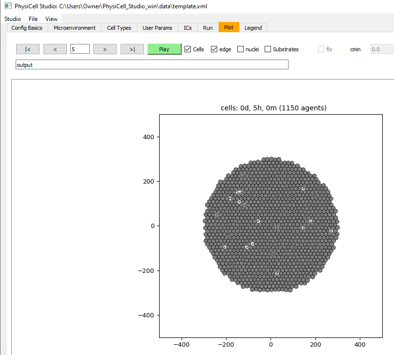

Tutorials
=========

.. _tutorials:

Template model: default
-----------------------

.. image:: ../images/studio_template_config.PNG
* the Configuration Basics tab that defines the domain and various high-level simulation parameters
------------

.. image:: ../images/studio_template_microenv.PNG
* the Microenvironment tab where substrates and signals are defined. Just one substrate is defined in the default `template` model, but it is not used (yet).

.. image:: ../images/studio_template_celltypes.PNG
* the Cell Types tab where different cell types can be defined to have different phenotypic behaviors. For the default `template` model, there is only one cell type defined (initially). Note there are subtabs which define each cell type's phenotype. If you look at some of those subtabs, you'll see that the default `template` model allows cell death and mechanics, but no motility and no secretion/uptake of the substrate.

.. image:: ../images/studio_template_run.PNG
* click the `Run simulation`. Information about the overall model will quickly appear, followed by delayed output lines whenever output files are saved (based on the time intervals on the `Config Basics` tab).

.. image:: ../images/studio_template_plot_t0.PNG
* At time=0, we see the initial conditions: 5 cells positioned randomly in the domain. Note the "5" is specified in the `User Params` tab as the "number_of_cells".

.. image:: ../images/studio_template_plot_5days.PNG
* Results (cells) at the end of the simulation (5 days).

Template model: disk for ICs
----------------------------

.. image:: ../images/studio_template_ICs_disk.PNG
* the `ICs` (Initial Conditions) tab, let's define some relatively simple starting positions for cells. The output will be a .csv file containing: `x,y,z,cell type` Here, we create a disk of hexagonally packed cells. Press `Plot` to see results and `->cells.csv` to write the .csv file. You will then provide this .csv filename on the Config Basics tab.

.. image:: ../images/studio_template_config_ICs_enable_csv.PNG
* In the `Config Basics` tab, we need to enable (check) the cells.csv and change the folder to be "."

.. image:: ../images/studio_template_user_params_no_random_cells.PNG
* the `User Params` tab defines parameters considered to be "global" to a simulation (vs. `Custom Data`, the subtab in `Cell Types` which define parameters specific to cell types). Here, we change # of randomly placed cells to be 0 (because we only want to use the cells defined in the .csv file).

.. comment_line image:: ../images/studio_template_config_ICs_folder.PNG

.. image:: ../images/studio_template_run_disk.PNG
* when we run the simulation now, we see there are 1150 cells initially (all from the cells.csv).

* results after 5 hours. 

.. image:: ../images/studio_template_plot_disk_20hr.PNG
* results after 20 hours. Note the cells are unrealistically overlapping, a situation we can adjust with additional edits to the model.

Template model: diffusion
-------------------------

.. image:: ../images/template_diffusion_config.png
* In this version of the model, we will allow diffusion of the substrate. First, in the Config tab, let's reduce the Max Time to 120 mins, set the Save intervals to 5 mins, and disable (uncheck) the cells.csv. Also, in the `User Params` tab, let's set the "number_of_cells" to 10 (not shown here).

.. image:: ../images/template_diffusion_microenv.png
* In the `Microenvironment` tab, set the diffusion coef=1000, decay rate=0, and Dirichlet Boundary Conditions=38. In the `Run` tab, run the simulation.

.. image:: ../images/template_diffusion_plot5min.png
* In the `Plot` tab, **check** "Substrates" to display them and **check** "fix" to fix absolute values for the color map (cmin=0, cmax=38, and press Enter after changing those values). Then plot the results at 5 mins.

.. image:: ../images/template_diffusion_plot2hrs.png
* Plot the results at the end of the simulation (2 hrs). Note the substrate has diffused throughout the domain from the boundaries.

.. image:: ../images/template_diffusion_plot2hrs_cmap2.png
* Note if you uncheck "fix", the colormap will have a dynamic range, using whatever is min/max in the substrate data.
